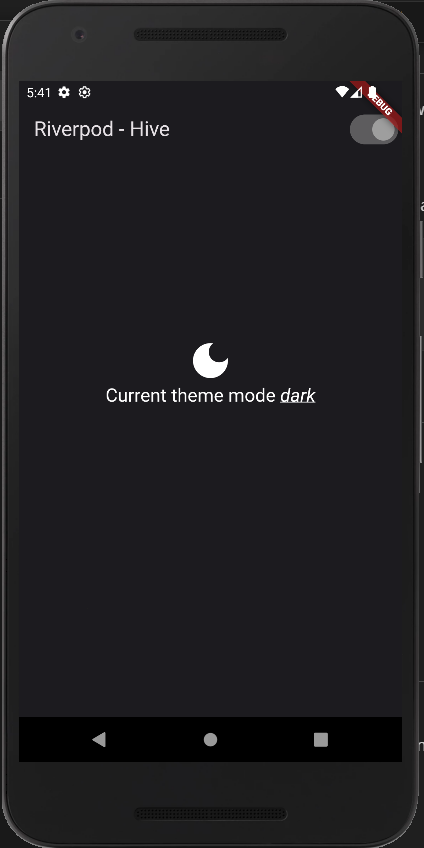
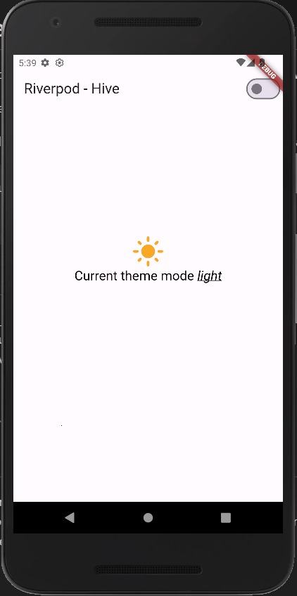

# Theme_Riverpod_Hive




<br/>

A Sample app to showcase how to integrate [Flutter Hive database](https://pub.dev/packages/hive_flutter) with [Riverpod](https://pub.dev/packages/riverpod), following best practices.

By default the selected theme mode is 'Light'.

If you want clear the ***saved theme mode*** uncomment this line (in main.dart):

```
if (kDebugMode) {
   await Hive.deleteBoxFromDisk(themeBoxKey);
}
```

## Versions

* flutter_riverpod ***^2.4.9***
* hive_flutter  ***^1.1.0***
* Kotlin version ***ext.kotlin_version = '1.7.0'***
* Gradle ***classpath "com.android.tools.build:gradle:7.1.3"***
* Flutter ***3.16.2***
* Dart ***3.2.2***


## Example chosen & App features
 - Save and persist Theme mode in the database.
 - Load persisted theme from the database on the next app launch.
 - Change theme dynamically.

## Misc
- Give it a 🌟 if you find this useful.
- Feel free to report an issue if you find one.